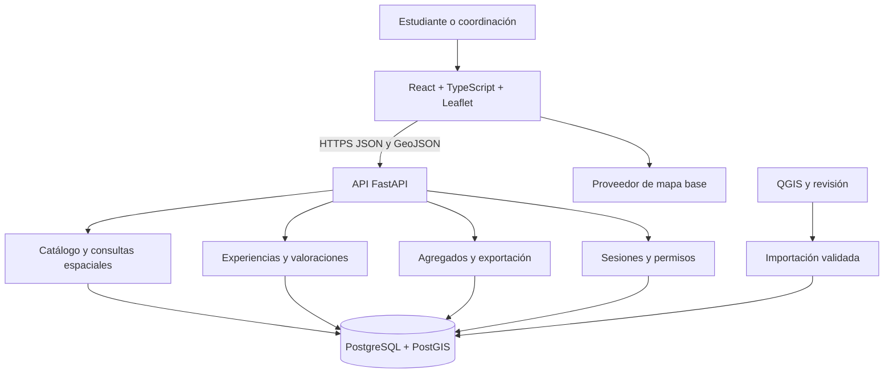

# Propuesta mejorada: SIG de centros de prácticas de Trabajo Social

Revisión: 24 de septiembre de 2026. Documento de planificación; no presenta resultados obtenidos ni software implementado.

La propuesta original se conserva en [docs/propuesta_original.md](docs/propuesta_original.md). Las bases del concurso se mantienen sin cambios.

## 1. Evaluación de viabilidad

El proyecto es viable como aplicación web académica. Su principal dependencia es conseguir un padrón verificable de centros y acceso autorizado a estudiantes que hayan realizado prácticas. El desarrollo del mapa es menos incierto que obtener información suficiente para comparar instituciones.

La idea central es adecuada: integrar ubicación, consultas espaciales y experiencia estudiantil. Debe fortalecerse como investigación mediante una evaluación de utilidad con usuarios. Construir muchos módulos no demuestra que el sistema resuelva el problema.

Cambios principales respecto de la propuesta inicial:

- Orientar el sistema a consultar y comparar alternativas, sin prometer asignar plazas ni determinar un mejor centro universal.
- Separar proximidad geográfica, experiencia formativa y disponibilidad. Un centro cercano y bien valorado puede no tener vacantes.
- Evaluar cada sede y periodo: una institución puede tener varias ubicaciones y experiencias distintas.
- Presentar dimensiones y cantidad de respuestas antes de un índice global.
- Reservar tiempo para instrumentos, recolección, análisis y artículo, postergando funciones secundarias.

Sin acceso a participantes se puede construir un prototipo técnico, pero no demostrar valoración estudiantil ni utilidad real. Los centros y puntajes del documento original son ejemplos, no datos verificados.

## 2. Título, delimitación y aporte

**Título propuesto:** Sistema web geográfico para consultar y comparar centros de prácticas preprofesionales de Trabajo Social de la UNCP, Huancayo, 2026.

Tiene 23 palabras contadas por espacios, dentro del máximo de 25. Mantener 2026 únicamente si corresponde al periodo real del estudio.

Ámbito propuesto: sedes registradas por la coordinación de prácticas de Trabajo Social de la UNCP en Huancayo, El Tambo y Chilca, provincia de Huancayo. Confirmar este alcance con el padrón y definir el periodo académico antes de recolectar información.

El aporte será un procedimiento reproducible de integración de datos institucionales, proximidad espacial y experiencias estudiantiles, acompañado de evidencia sobre su utilidad para consultar y comparar. Utilizar PostGIS o Leaflet no constituye por sí solo novedad científica; esta debe contrastarse con antecedentes.

## 3. Problema y objetivos

La posible dispersión, desactualización y falta de integración de la información es un problema por comprobar mediante entrevistas a la coordinación, revisión de registros y consulta a estudiantes. No presentarlo como hecho demostrado sin diagnóstico.

**Pregunta:** ¿En qué medida un sistema web geográfico facilita consultar y comparar centros de prácticas de Trabajo Social de la UNCP frente al medio de consulta disponible?

**Objetivo general:** desarrollar y evaluar un sistema web geográfico que integre información institucional, proximidad espacial y valoración estudiantil para apoyar la consulta y comparación de centros de prácticas.

| Objetivo específico | Evidencia |
|---|---|
| Diagnosticar necesidades y registros disponibles | Entrevistas, inventario de fuentes y requerimientos |
| Construir un padrón georreferenciado verificable | Base depurada, metadatos y verificaciones |
| Definir dimensiones de valoración pertinentes | Instrumento revisado y pilotado |
| Implementar consultas y comparación | Aplicación y pruebas reproducibles |
| Evaluar utilidad y desempeño de consulta | Sesiones de tareas y análisis comparativo |

Si se requiere una hipótesis, proponer que el sistema reduce tiempo de consulta sin disminuir éxito en las tareas. No prometer significancia estadística ni mejora en la calidad de las prácticas, que requeriría seguimiento adicional.

## 4. Relación con el concurso

El archivo recibido contiene extractos de las páginas 9, 11 y 12 de un documento de 15 páginas. No permite confirmar inscripción, elegibilidad, extensión total ni cronograma. La rúbrica está fechada el 16 de julio de 2026; verificar si corresponde a la convocatoria vigente para el equipo.

| Criterio | Puntos | Cómo atenderlo |
|---|---:|---|
| Título | 4 | Máximo 25 palabras y delimitaciones |
| Resumen | 12 | Hasta 250 palabras, método, desarrollo, resultados reales y relevancia; al menos tres palabras clave |
| Introducción | 15 | Diagnóstico, antecedentes y propósito; máximo una página y media |
| Cuerpo | 16 | Método, población/muestra, instrumentos y procedimiento |
| Resultados | 24 | Tablas y figuras explicadas, vinculadas a instrumentos y discutidas con otros estudios |
| Conclusiones | 12 | Lo demostrado, ventajas, limitaciones y aplicación futura |
| Referencias | 7 | Más de diez referencias pertinentes y verificadas en APA |
| Presentación | 10 | Demostración y defensa técnica/metodológica |
| Total | 100 | |

El criterio de referencias tiene una redacción ambigua; confirmar cómo se aplican sus subcriterios. La documentación de software no sustituye antecedentes académicos.

Formato del artículo según el extracto: título Calibri 16, encabezados Calibri 14 y texto Calibri 12. Este Markdown es una guía de trabajo, no el artículo formateado. El resumen final se redacta después de obtener resultados.

## 5. Alcance funcional

### Primera versión que se desarrollará y evaluará

| Módulo | Funciones |
|---|---|
| Catálogo | Mapa y lista, búsqueda por nombre, filtros por distrito y tipo |
| Ficha | Institución, sede, dirección, estado, fuente y fecha de verificación |
| Consulta espacial | Distancia y radio desde referencia institucional o punto elegido |
| Comparador | Hasta tres sedes con distancia, dimensiones, periodo y número de respuestas |
| Valoración | Formulario para experiencias validadas y resultados agregados |
| Administración | Importar CSV, verificar sedes, editar/desactivar y habilitar participantes |
| Resultados | Conteos, cobertura y exportación agregada CSV |

Criterios de aceptación: mapa y lista coinciden; faltantes no se convierten en cero; distancia se etiqueta como geográfica y no recorrido; una evaluación por experiencia y versión; permisos comprobados en servidor; CSV coherente con pantalla.

La encuesta de prioridades puede aplicarse externamente e importarse: no hace falta construir un generador de encuestas.

Opcionales posteriores: índice explicable, mapas temáticos, PDF y geolocalización voluntaria sin guardar ubicación personal.

Fuera del MVP: rutas, tiempos reales de viaje, tráfico, navegación GPS, inteligencia artificial, predicción de seguridad, asignación automática y aplicación móvil nativa. Tampoco publicar comentarios abiertos en esta versión. Los comentarios de investigación, si se recogen, tendrán acceso restringido y revisión de información identificable.

No priorizar mapas de calor con pocos centros. Un conteo por distrito es más interpretable; pocos centros no demuestran déficit sin conocer demanda y capacidad.

## 6. Metodología y evaluación

Se propone investigación aplicada mediante diseño y evaluación de un artefacto, usando Design Science Research como marco: diagnóstico, objetivos, diseño, demostración, evaluación y comunicación [S1]. Combinar mediciones de tareas con observaciones cualitativas.

### Poblaciones

- Sedes: intentar incluir todo el padrón elegible y reportar cobertura/exclusiones.
- Estudiantes con experiencia: pueden valorar una sede y periodo verificables.
- Estudiantes que buscan alternativas: participantes de evaluación de consulta; pueden diferir de quienes valoran.
- Coordinación y especialistas: informantes y revisores, no sustitutos de participantes estudiantiles.

No inventar tamaño de muestra. Primero conocer población y acceso. Si es viable, convocar a todos y reportar no respuesta. Si se usa conveniencia, explicitar sesgos. Para contrastes confirmatorios, justificar tamaño según efecto relevante, variabilidad y diseño; con un piloto pequeño, informar resultados exploratorios.

### Instrumentos separados

| Instrumento | Qué recoge |
|---|---|
| Ficha institucional/espacial | Ubicación, estado, fuente, fecha y calidad |
| Encuesta de prioridades | Importancia de criterios para comparar |
| Encuesta de experiencia | Percepción de la sede durante un periodo |
| Protocolo de tareas | Éxito, tiempo, errores e incidencias |
| Formulario o entrevista posterior | Utilidad percibida y dificultades |

Dimensiones iniciales para revisar: supervisión, oportunidades de aprendizaje y condiciones para realizar actividades. La distancia se calcula aparte. Evitar sumar valoración general a sus propios componentes.

Cada pregunta debe tratar un aspecto, tener anclajes claros 1–5 y permitir no aplica/no puedo evaluar. Revisar con especialistas de Trabajo Social y metodología, pilotar comprensión y fijar versión antes de recoger respuestas. No calcular consistencia interna de dimensiones distintas como si fueran una sola escala. Describir distribuciones, medianas y cantidades; declarar supuestos si se usan medias exploratorias.

### Evaluación comparativa

Comparar el sistema con una tabla que contenga el mismo padrón y valoraciones para aislar el efecto de la interfaz. Una comparación adicional con el procedimiento habitual puede incluir diferencias de contenido y debe reconocerlas.

Propuesta: medidas repetidas, orden contrabalanceado y dos conjuntos equivalentes de tareas para reducir aprendizaje. Asignar orden aleatoriamente si es viable. Estandarizar instrucciones, entrenamiento, dispositivo y límite de tiempo.

Tareas con respuesta correcta definida previamente:

1. Encontrar una sede de cierto tipo dentro de un radio.
2. Identificar la más próxima que cumpla filtros.
3. Comparar una dimensión e identificar cantidad de respuestas.
4. Reconocer disponibilidad desconocida o evidencia insuficiente.

Medir éxito, segundos hasta responder, abandonos y errores de interpretación. Recoger utilidad percibida sin llamar validada a una escala propia. Predefinir tratamiento de fallos/faltantes: no comparar solo tiempos exitosos ignorando diferencias en errores.

Analizar diferencias por participante, dispersión e intervalos/pruebas acordes al diseño pareado cuando se justifique. Reportar exclusiones y no respuesta. La participación será voluntaria y no afectará notas o asignaciones.

Los resultados pueden mostrar mejora, ausencia de cambio o dificultades. No escribir porcentajes de mejora antes de evaluar.

## 7. Valoraciones e índice opcional

Mostrar primero dimensiones por sede y periodo, cantidad de respuestas y faltantes. La distancia depende del origen seleccionado y no es una característica fija del centro.

Umbral provisional de publicación: cinco participantes distintos por sede/periodo. Es una regla operativa, no garantía estadística ni anonimato; revisarla según posibilidad de identificación. Por debajo, mostrar evidencia insuficiente y suprimir desgloses reveladores. No mezclar periodos sin indicarlo.

El índice será exploratorio, sujeto a criterios no redundantes y validación:

```text
I(sede, origen, versión) = suma(peso_j × puntuación_j)
suma de pesos = 1; pesos >= 0; puntuaciones entre 0 y 100
```

Transformaciones posibles para revisar antes de analizar:

- Ítem 1–5: puntuación = 25 × (media − 1), declarando el supuesto cuantitativo.
- Cercanía: puntuación = 100 × max(0, 1 − distancia/D), con D positivo, previamente fijado y justificado. No mide accesibilidad real.
- Pesos: normalizar importancia media es una opción simple, pero supone tratar la escala como cuantitativa. Contrastar con pesos iguales.

Si falta un criterio requerido o evidencia suficiente, no emitir índice; no redistribuir pesos silenciosamente. Mostrar contribuciones, origen, periodo y versión. Examinar sensibilidad con pesos iguales, variaciones relativas de ±20 % renormalizadas y cambios de D. Si el orden es inestable, explicarlo.

No reutilizar los porcentajes ilustrativos originales como datos. Evitar categorías alta/media/baja sin cortes justificados. Un puntaje no es porcentaje de calidad ni probabilidad de éxito.

## 8. Lenguajes y herramientas

Recomendación para este alcance; fijar versiones compatibles al iniciar implementación.

| Capa | Elección | Motivo |
|---|---|---|
| Interfaz | TypeScript, React, Vite, HTML/CSS | Formularios, mapa y comparador con componentes tipados |
| Mapa | Leaflet | Puntos y polígonos GeoJSON |
| API | Python y FastAPI | Validación y servicios de consulta |
| Base | PostgreSQL/PostGIS y SQL | Integridad relacional y consultas espaciales |
| Persistencia | SQLAlchemy, GeoAlchemy2, Alembic | Modelos y migraciones |
| Preparación espacial | QGIS | Revisar coordenadas, capas y proyecciones |
| Análisis | Python/pandas y estadística según protocolo | Reproducibilidad |
| Entorno | Git, Docker Compose, HTTPS al publicar | Configuración repetible y operación sencilla |

TypeScript, Python y SQL son los lenguajes principales; React, FastAPI y Leaflet son herramientas. Sus documentaciones oficiales respaldan las integraciones propuestas [S2–S4]. Si el equipo no conoce React y el plazo es muy corto, puede reducirse a TypeScript y Leaflet; cerrar esa elección antes de implementar.

## 9. Arquitectura

Monolito modular: una interfaz, una API y una base. No se requieren microservicios ni Kubernetes.



El navegador no accede directamente a la base. Las fórmulas y reglas de publicación se ejecutan en servidor para mantener coherencia.

Flujo: importar/verificar sede → validar experiencia → recibir evaluación → generar agregados → consultar/comparar.

Roles: estudiante consulta y evalúa experiencias habilitadas; coordinación valida sedes y participantes; administración gestiona cuentas. Piloto autenticado. Un catálogo público posterior requerirá definir datos institucionales autorizados.

Autenticación propuesta: cuentas locales, contraseñas con hash robusto, cookies de sesión HttpOnly/Secure, protección CSRF y autorización en API. No depender de una integración institucional todavía inexistente ni confiar en un identificador enviado por el navegador como prueba de identidad.

## 10. Modelo de datos

| Entidad | Contenido |
|---|---|
| Institución | ID, nombre y tipo |
| Sede | Institución, dirección, punto, distrito, fuente, fecha/estado de verificación, activa |
| Periodo | Código y fechas |
| Situación de prácticas | Sede, periodo, convenio/habilitación, fuente; vacantes solo confirmadas |
| Distrito | UBIGEO como texto, nombre, geometría y versión/fuente |
| Usuario | ID, rol, credencial e identidad mínima restringida |
| Experiencia | Usuario, sede, periodo y validación |
| Instrumento/ítem | Versión, dimensión, texto y opciones |
| Evaluación/respuesta | Experiencia, versión, fecha, ítem y valor/no aplica |
| Prioridades | Participante seudonimizado, versión e importancia |
| Método de índice | Versión, pesos, transformaciones y umbrales si se implementa |
| Auditoría | Actor, acción, entidad y fecha |

Aplicar restricciones contra duplicados y valores fuera de rango. Desactivar sedes con historial, no borrarlas. No modificar instrumentos ya aplicados. Separar identidad de datos de análisis; seudonimización no equivale a anonimato.

### Decisiones espaciales

- Guardar geometry(Point, 4326), longitud primero y latitud después, como GeoJSON.
- Convertir a geography para radio y distancia en metros. ST_DWithin documenta estas unidades [S5]. No calcular kilómetros directamente sobre grados.
- Índice GiST sobre geometría y de expresión sobre la conversión a geography para consultas frecuentes.
- ST_Distance obtiene distancia geográfica, no recorrido o tiempo.
- Asignar distrito con una relación que incluya bordes, como ST_Covers, revisando coincidencias múltiples o ausentes.
- Verificar el punto institucional de referencia con la facultad; no inventar coordenadas.
- Conservar CRS, procedencia, fecha y transformaciones de capas.

Consulta conceptual con parámetros enlazados, nunca concatenados:

```sql
SELECT id,
       ST_Distance(ubicacion::geography,
         ST_SetSRID(ST_MakePoint(:lon, :lat), 4326)::geography) AS distancia_m
FROM sede
WHERE activa = true
  AND ST_DWithin(ubicacion::geography,
        ST_SetSRID(ST_MakePoint(:lon, :lat), 4326)::geography, :radio_m)
ORDER BY distancia_m, id;
```

Validar coordenadas, radio positivo y límites de respuesta. No guardar orígenes personales ni incluirlos en logs; si se habilitan, usar cuerpo de solicitud con registro sensible desactivado.

## 11. Información base y obtención

| Información | Fuente prioritaria | Verificación |
|---|---|---|
| Sedes | Coordinación y registros autorizados | Institución y periodo |
| Ubicación | Dirección institucional y revisión cartográfica/visita | Sede correcta y precisión |
| Convenios/vacantes | Coordinación | Confirmado, histórico o desconocido |
| Distritos/UBIGEO | IDE del INEI | Metadatos, edición, licencia y geometría |
| Mapa base | OpenStreetMap mediante proveedor | Atribución y condiciones |
| Experiencia/prioridades | Instrumentos propios | Consentimiento, elegibilidad y faltantes |
| Medio actual | Coordinación y estudiantes | Flujo real de consulta |

El INEI ofrece servicios espaciales distritales [S6]; es fuente candidata, no una capa ya validada aquí. No se han confirmado centros reales, coordenadas, matrículas ni vacantes.

Plantilla CSV: codigo_sede, nombre_institucion, nombre_sede, tipo, direccion, ubigeo, longitud, latitud, estado_verificacion, fuente, fecha_verificacion. Importar estados por periodo aparte; excluir identidades y respuestas de exportaciones públicas.

Proceso: autorización/fuente → original restringido → normalización → duplicados → revisión en QGIS → distrito → revisión institucional → importación → informe de aceptados/rechazados. No corregir coordenadas dudosas silenciosamente.

OpenStreetMap aporta datos; Leaflet los muestra mediante un proveedor de teselas. Los servidores públicos tienen políticas y disponibilidad limitada: mantener atribución, evitar descarga masiva y permitir cambiar proveedor [S7]. Para el MVP puede ubicarse cada sede manualmente. Si se añade Nominatim, revisar su política [S8]. Google Maps no es necesario para este alcance.

## 12. Estructura objetivo

Estructura propuesta, todavía no implementada:

```text
Proyecto_Final/
├── README.md
├── informacion_nuestro_proyecto.md
├── informacion_concurso_investigacion.md
├── docs/
│   ├── propuesta_original.md
│   ├── investigacion/     # protocolo, instrumentos y matriz de consistencia
│   ├── arquitectura/     # decisiones y contratos
│   └── resultados/       # tablas/figuras sin identidades
├── frontend/src/
│   ├── features/         # mapa, catálogo, comparación y formularios
│   ├── components/
│   ├── services/         # cliente API
│   └── types/
├── backend/
│   ├── app/
│   │   ├── api/
│   │   ├── core/         # configuración, sesiones y permisos
│   │   ├── models/
│   │   ├── schemas/
│   │   ├── services/     # reglas y consultas
│   │   └── db/
│   ├── migrations/
│   └── tests/
├── scripts/              # importación y calidad
├── analysis/             # análisis reproducible
├── data/synthetic/       # ejemplos claramente ficticios
└── infra/                # Compose y publicación
```

Datos personales, secretos y respaldos fuera de Git, en almacenamiento restringido. Mantener reglas en servicios y rutas simples, sin multiplicar capas innecesarias.

## 13. Organización y cronograma

Estimación de ocho semanas para dos o tres integrantes con bases web y acceso oportuno a datos. No es un plazo confirmado del concurso. Una persona aprendiendo todas las tecnologías necesitará más tiempo o menor alcance.

| Fase | Tiempo | Entregable |
|---|---|---|
| Viabilidad/protocolo | Semana 1 | Convocatoria, padrón, ámbito y participantes |
| Datos/instrumentos | Semana 2 | Padrón inicial, revisión, piloto y versión fija |
| Núcleo espacial | Semanas 3–4 | Mapa, catálogo, radio y comparador |
| Valoraciones/administración | Semana 5 | Formularios, agregados y permisos |
| Evaluación | Semana 6 | Sesiones y registro de incidencias |
| Análisis/artículo | Semana 7 | Tablas, discusión y limitaciones |
| Correcciones/defensa | Semana 8 | Versión estable y demostración |

Reparto sugerido: investigación/datos, API/PostGIS e interfaz. Si son dos, dividir frontend/backend y compartir investigación con tareas semanales. Asesor y coordinación revisan contenido e instrumentos.

El primer hito es un lote real autorizado y verificado, con búsqueda por radio y comparación. Resolver acceso antes de invertir en dashboard o índice. La encuesta requiere instrumento fijo y la evaluación requiere sistema estable.

## 14. Pruebas, operación y riesgos

Al implementar verificar: unidades y orden de coordenadas; radio con casos dentro/fuera/borde; muestra de distancias en QGIS; duplicados y permisos; no aplica y agregados insuficientes; coherencia mapa/lista/CSV; flujo completo móvil y teclado. Si hay índice, probar fórmula, faltantes y versiones.

Publicación propuesta: frontend estático y API detrás de proxy HTTPS, base sin exposición pública. Docker Compose basta para un entorno pequeño. Elegir alojamiento según presupuesto y soporte PostGIS, sin asumir gratuidad permanente. Probar restauración de respaldos antes del piloto.

| Riesgo | Respuesta |
|---|---|
| Sin padrón o permiso | Resolver antes del desarrollo completo |
| Pocas respuestas | Mostrar evidencia insuficiente; evitar ranking |
| Sesgo o recuerdo | Delimitar periodos y reportar limitaciones |
| Confusión espacial | Etiquetas y tarea de comprensión |
| Disponibilidad cambiante | Fuente/fecha y estado desconocido cuando corresponda |
| Identificación personal | Minimización, permisos y revisión de agregados |
| Sin internet en defensa | Demo local autorizada o sintética, sin descarga masiva de teselas |
| Exceso de alcance | Postergar índice, PDF y mapas de calor |

Acordar consentimiento, responsables, conservación/eliminación y revisión institucional antes de recolectar datos personales. No pedir domicilios, datos de beneficiarios ni seguimiento de ubicación.

## 15. Artículo, fuentes y pendientes

Figuras/tablas previstas: distribución de sedes, cobertura/calidad del padrón, perfil agregado, dimensiones y número de respuestas, éxito/tiempo por condición y errores. Añadir sensibilidad si se implementa índice.

Preparar más de diez referencias académicas pertinentes sobre SIG y localización de servicios/prácticas, multicriterio, experiencia formativa y evaluación de sistemas. Matriz: referencia, contexto, método, población, resultados, limitaciones y relación con el proyecto. No afirmar inexistencia de antecedentes sin revisión.

Las siguientes fuentes sustentan decisiones preliminares; no sustituyen la revisión académica completa. Completar metadatos APA desde las publicaciones originales.

- [S1: Peffers y colaboradores, Design Science Research Process](https://arxiv.org/abs/2006.02763).
- [S2: React con TypeScript](https://react.dev/learn/typescript).
- [S3: Documentación de Leaflet](https://leafletjs.com/reference).
- [S4: FastAPI en contenedores](https://fastapi.tiangolo.com/deployment/docker/).
- [S5: PostGIS ST_DWithin](https://postgis.net/docs/ST_DWithin.html).
- [S6: IDE del INEI](https://ide.inei.gob.pe/).
- [S7: Política de teselas OpenStreetMap](https://operations.osmfoundation.org/policies/tiles/).
- [S8: Política Nominatim](https://operations.osmfoundation.org/policies/nominatim/).

Pendientes antes de implementar: convocatoria completa y entrega, integrantes/experiencia, padrón/permisos, participantes, ámbito/periodo, instrumentos y presupuesto. El núcleo recomendado es información verificable, comparación clara y evaluación real antes de ampliar funciones.
